# FioreDeco 

# Tabla de Contenido

* [1. Presentación](#1-presentación)
* [2. Búsqueda de un cliente](#2-búsqueda)
* [3. Entrevista a cliente](#3-entrevista)
* [4. Buscando a Usuario](#4-Investigacion)
* [5. Entrevistas a Usuarios](#5-entrevista)
* [6. Prototipos, Figma](#6-prototiposdealta)
* [7. Testeo con Usuario](#8-iesteo)
* [8. Investigación JavaScript](#8-investigacion)
* [9. Html y Css](#9-hC)
* [10. Término de página](#-término)

## 1. Presentación

En este proyecto se solicitaba crear una página web donde se pudiera dar uso a la validación de tarjeta de crédito, proceso el cual debía ser creado a través de javascript basado en el algoritmo luhn.

## 2. Búsqueda de un cliente

Comencé a buscar por Instagram páginas de ventas de plantas, cree un pequeño listado con el cúal me base para determinar a mi usuario.

Estos eran:

- ¿Cómo se comunica con el cliente?
- ¿Que venden?
- ¿Qué redes sociales utiliza?
- ¿Cómo es su diseño en general y que comunica con el?

Basándome en estos contextos comencé mi búsqueda por Instagram llegando a
[Fiore y Belleza](https://www.instagram.com/fioreybellezza/)

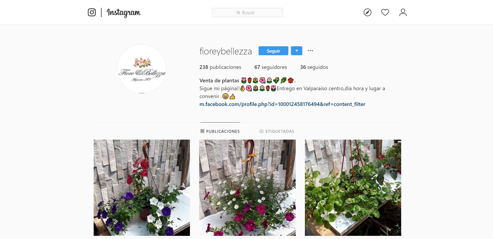

## 3. Investigacion de Usuario

A simple vista y por la cantidad de imágenes se siente que realmente va bien enfocada en vender plantas, pero, su fuerte no era instagram si no que su página de Facebook el cúal ella utilizaba para ventas y como perfil personal pues en su facebook me encontré con un sin fin de imagenes que no correspondian a la venta de plantas, dado esto me arriesgue en consultarle sobre mi proyecto y la posibilidad de usar su nombre para crear mi página y así tener la experiencia de tratar con un cliente.

Dada la distancia no se pudo concretar una entrevista presencial, pero si logré hablar por Facebook con ella.

## 4. Entrevista Cliente

Entrevista con Cliente via correo electronico.

Alejandra, 22 años, trabaja en atención al cliente.
Haciendo un pequeña introducción a la entrevista comenzamos.

- Cuéntame un poco sobre los productos que tu vendes.

 Es la venta de plantas, nosotros tenemos un mini vivero donde resguardamos un montón
 de plantas decorativas, también tenemos algunas exóticas.

- ¿Desde cuando están en el negocio de venta de plantas?

Mi madre comenzó por allá en el 2014 acá en Valparaíso, ella vendía pequeñas plantas que tenía en el jardín ya que la tierra de su jardín es muy buena, las flores y árboles son realmente preciosos, le comenzó a ir bien en las ventas y así comenzamos a vender todo tipo de flores a la gente del sector, ahora yo quisiera seguir este proyecto aunque a veces no hay mucho tiempo para subir imágenes y las ventas no son tan buenas.

- ¿Crees que una página web te ayudara en ese sentido?

Si, por lo menos creo que la gente no estaría preguntando precios, información sobre qué plantas tengo.

- ¿Cuales son los principales dolores de cabeza que te a dado este trabajo? 

La atención al público, algunas personas son muy amables y comprensivas, otras no tanto, pero me entretiene.

 - ¿Cuales son las plantas que más ventas a generado en los años que llevan vendiendolas? 

Siempre las favoritas son las decorativas, flores, rosas, les encanta a la gente.

 - ¿Cual es el diferenciador que tienen sus plantas con el resto de los que venden este producto?

 No suelo compararme con la competencia, me gusta que mi negocio sea algo más que solo algo lucrativo, pero puedo asegurar que nuestras plantas son muy bien cuidadas y queridas, me preocupa que asi como yo ayude a esas plantas a crecer mis clientes hagan lo mismo una vez se las hayan llevado.

 - ¿A que se refiere con "algo más que solo lucrativo"?

No me gusta que se vean las plantas como un negocio, bueno, yo estoy vendiendo plantas, suena irónico, pero, también las quiero, cuando las siembro siempre les doy amor, les hablo a mis plantas, me preocupo que estén saludables y por eso mismo me gustaría transmitir ese amor a los que se llevan las plantas y que sepan que mis plantas son queridas por eso florecen más hermosas.

- En tu página web ¿Que te gustaría ver? 

Quiero que sea clara en que estamos vendiendo, que hayan plantas, como estilo la casa de las flores jajaja, todo bien natural en la página, que se cuente mi historia y la de mi familia, de por que queremos que los clientes sepan que se llevan plantas bien cuidadas, que los cliente sepan los pasos a seguir en cómo cuidar una planta, eso en general.

Teniendo estos datos comenzare a realizar prototipos donde iré mostrandotelos para que así posteriormente vayas evaluando el proceso y quedemos en común acuerdo con el diseño y la usabilidad de la página.

Gracias por cooperar con mi proyecto.

No gracias a ti por encontrar mi Instagram y darme ideas con esto de la página web.

## 4. Buscando Usuarios

Para buscar a los usuarios comencé con un pequeño [Formulario](https://docs.google.com/forms/d/e/1FAIpQLScVJ9pjR_AUz97taJOiWEJM0MGYpRgRQKpKUT1gW0178QtUyA/closedform) el cual me ayudaría a seleccionar entre varios de mis contactos a gente que le gustan las plantas.

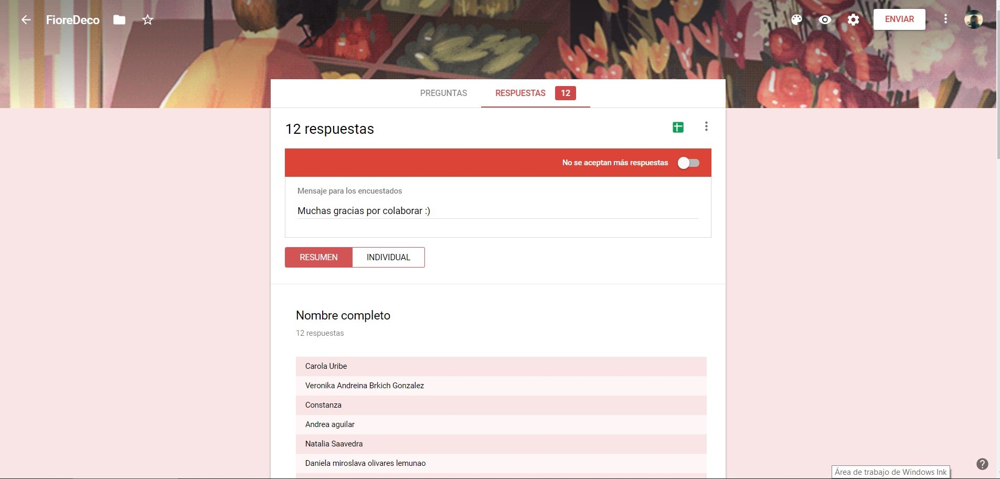
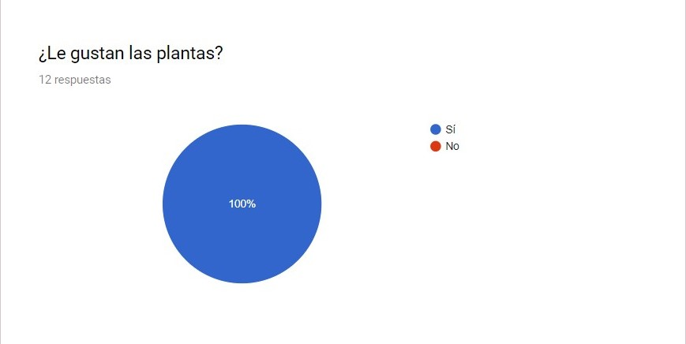
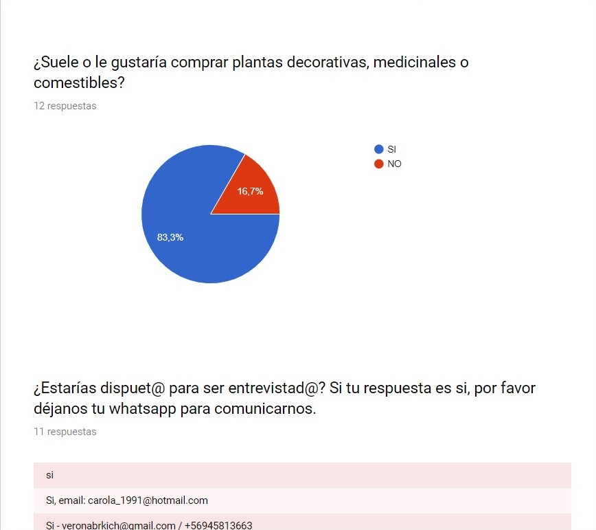

## 5. Entrevistas a Usuarios

Obtenido una vez los datos, comencé con las entrevistas a las personas que estaban dispuestas, creando una pauta para poder obtener información inicial para la página web.

El cúal era de preguntas bastante sencillas como era preguntar sobre su nombre, edad, hobbie, ocupación, para luego pasar a preguntar sobre sus gustos por las plantas, sobre que le gustaría ver en una página web de venta de plantas, que colores utilizas, qué imágenes.

Lamentablemente por error no pude guardar los audios de mis tres entrevistados, aun así, logré obtener información realmente relevante para la creación de la página web y así comenzar con los prototipos.
 

## Esta información era: 

-  Plantas decorativas
-  Información sobre cómo cuidarlas
-  Significados de las plantas
-  Información de las plantas que se les está vendiendo
-  Buenos precios.

Con estos datos y buscando en internet páginas sobre la venta de plantas comencé a crear los primeros prototipos.

## 6. Prototipos, Figma.

> Prototipo 1

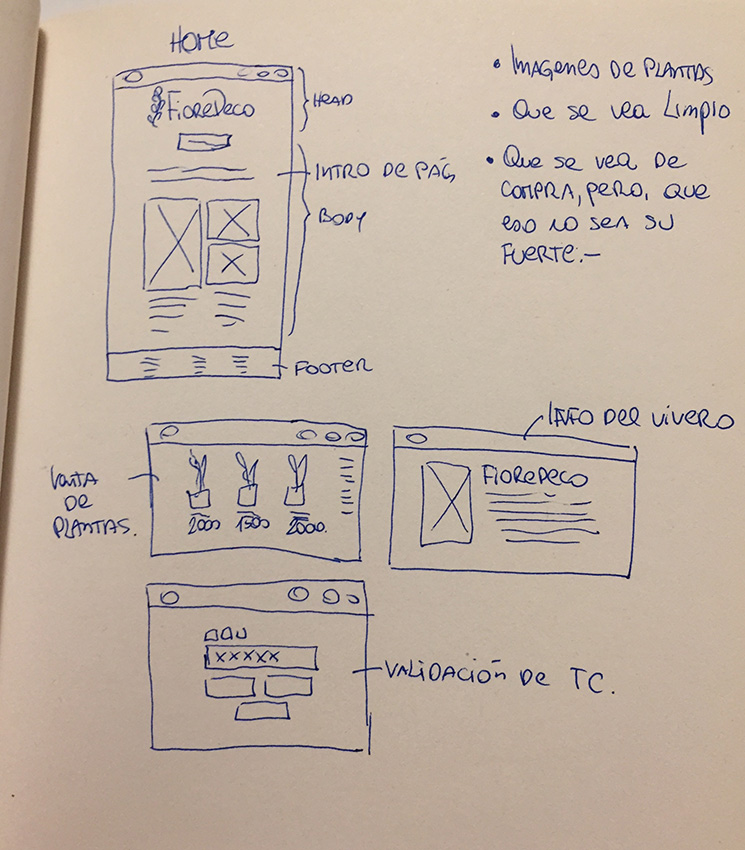

> [Prototipo 2](https://www.figma.com/file/PH94TPFCOGsO2k6DdCirJA/FioreDeco-Prototipo-2?node-id=0%3A1)

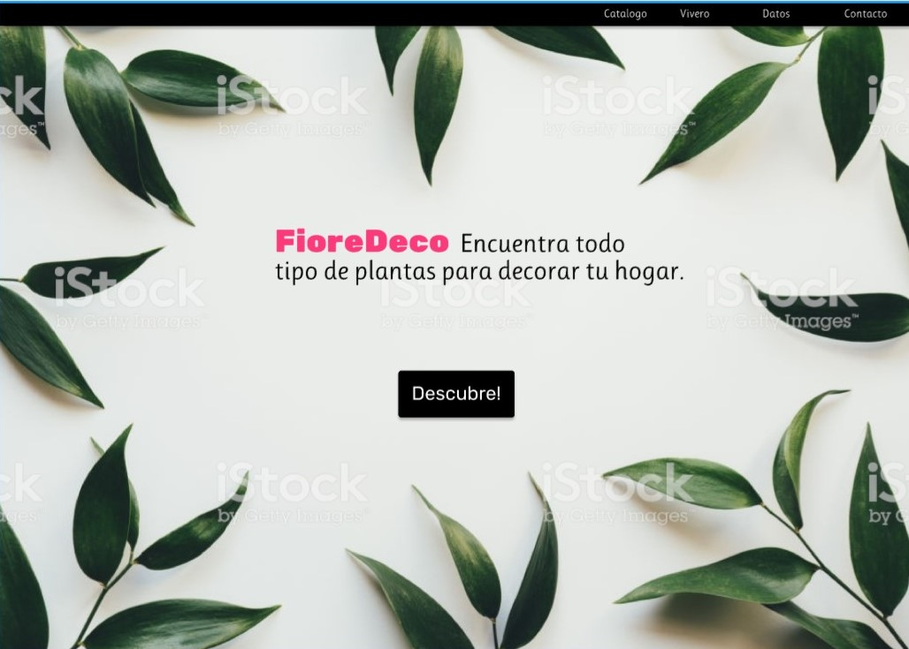

> [Prototipo2](https://www.figma.com/file/PH94TPFCOGsO2k6DdCirJA/FioreDeco-Prototipo-2?node-id=0%3A1)

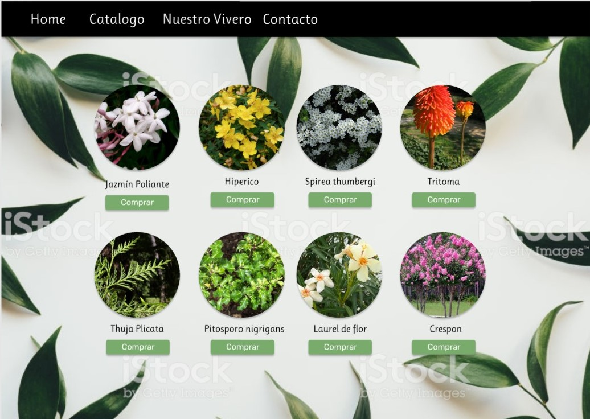

> [Prototipo 3](https://www.figma.com/proto/O7es0OfwR82x2zJGGFQrCQ/prototipo-3?node-id=3%3A18&scaling=min-zoom)

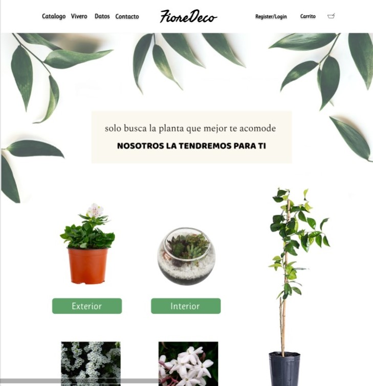

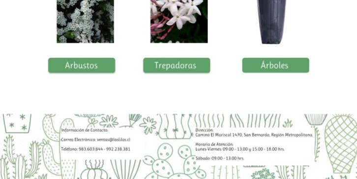

> [Prototipo 4](https://www.figma.com/proto/O7es0OfwR82x2zJGGFQrCQ/prototipo-3?scaling=min-zoom)

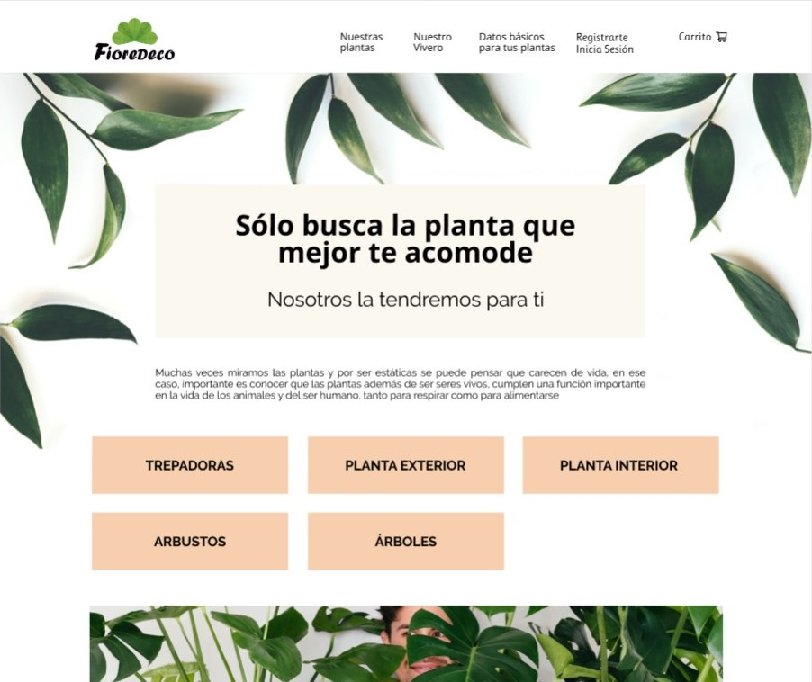
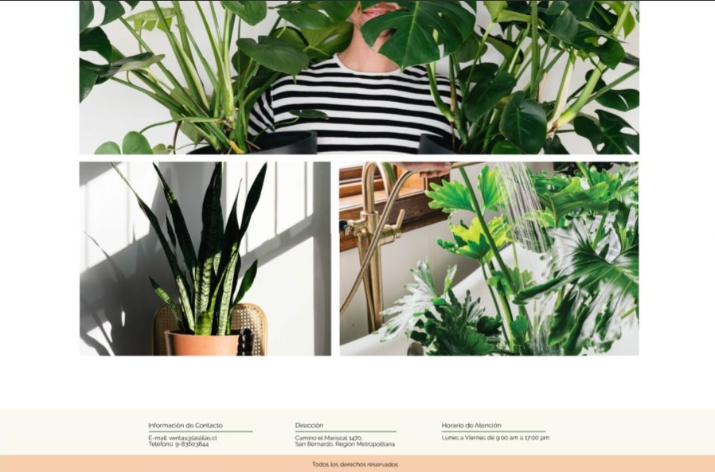

> [Prototipo 5](https://www.figma.com/proto/O7es0OfwR82x2zJGGFQrCQ/prototipo-3?scaling=min-zoom&node-id=3%3A18)

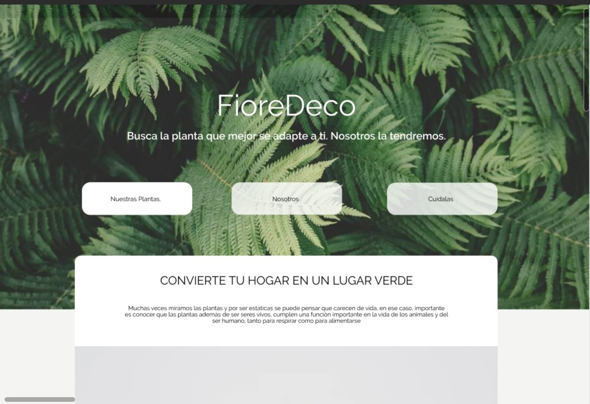
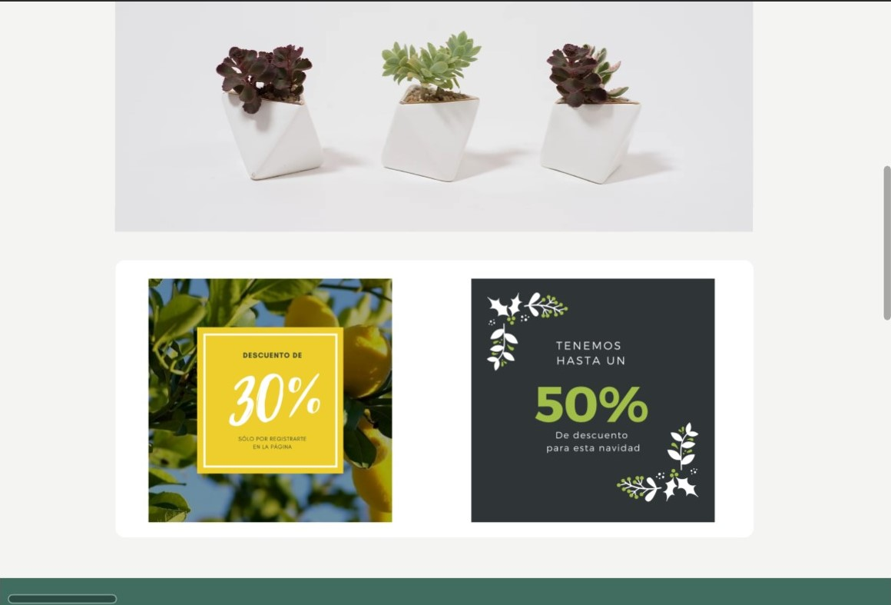

## 7. Testeo con Usuario

Para llegar a estos diseños se realizaron varias entrevistas a diferentes usuarios.

[Testeo 1](https://www.loom.com/share/66121bbbbc2b4c91b10feebd896008b1)

[Testeo 2](https://www.loom.com/share/5ac0903eeec14d42b95bdd95a633f6c5)

[Testeo 3](https://www.loom.com/share/66121bbbbc2b4c91b10feebd896008b1)

[Testeo 4](https://www.loom.com/share/80651c3f08a5400fb79af41de519ba3c)

- Observaciones

A varios usuarios les interesaba el cuidado de las plantas, como podrían tener, ofertas, los precios de los productos, algunos notaron faltas de ortografías y modismos nacionales, los cuales ayudaron a la mejora de la página.

No tuvieron gran dificultad de usabilidad, más la mayoría de los problemas dados eran por errores en mi Figma, ya que no tenía interacción en algunas partes.

## Diseño ##

> Tipografía Source Sans Pro", sans-serif

> Contraste, quería que las imágenes sobre salieran, para que el usuario se parte automáticamente de que la página trata de plantas

> Colores sólidos para que no dificulte la lectura

> Como página de presentación decidí no dejar el logo a una esquina porque deseaba que esa página resaltará sobre las otras.

> Sin negro para que no dificulte la lectura.

> Colores basado en paleta de colores de plantas.

## 8. Investigación JavaScript

Para lograr desarrollar la parte FrontEnd me base mucho en tutoriales, primero que nada hice un esquema del orden a como debería desarrollar JS,
estudie el algoritmo, aunque se me dificulto bastante, pero continúe buscando por internet, algunas compañeras me guiaron dandome ideas de como desarrollarlo, llegue hasta unas paginas donde desarrollaban el código, pero con un sin fin de cosas que no lograba entender ni estudiando en LMS, así que simplemente comencé a codear con lo que sabía apoyándome en tutoriales en ingles de Youtube.

## 9. Html y Css

Teniendo la estructura del diseño, fui a la par con Figma para crear la página web, me base en otras páginas buscando información respecto a cómo hacer el HTML y CSS mas profesional, que por lo menos su estructura no fuera tan básica, agregue bastantes HTMLS uno para cada sección de la página tomando lo que los usuarios me solicitaron.

## HTML 

> Index.html  Página principal, única con header diferente a los demás.

> plantas.html  Página secundaria que guarda las cuatro categorías principales de los     productos

> interior.html  Página de plantas interior del hogar.

> exterior.html  Página para productos de plantas exterior, para el jardín.

> hierba.html  Página de productos de hierbas.

> flores.htmls  Productos Flores.

> compra.html Página donde el usuario puede validar su tarjeta de crédito, única con JS

> nosotros.html  Historia sobre la venta de plantas.

> cuidalas.htmls  Página con consejos de como cuidar las plantas.

## CSS

> style.css

## Javascript

> validator.js   Único funcional en la página.

>index. Js

## 10. Término de página

### DIFICULTADES

Llegando al momento de subir la página me di cuenta que tenía el error 404 en github,atraso todo mi horario, rompiendo con la fecha de [Trello](https://trello.com/b/kfwnAqeh/card-validation) que habia creado pues me atrazo para terminar mi readme,
no logre solucionarlo así que a pesar del error decidí terminar lo poco que le faltaba a mi Readme priorizandolo.

El cliente no volvio a contestar los mensajes enviados, asi que decidi usar mi propio criterio para poder hacer la página basándose solamente en mis historias de Usuario.

### ALEGRÍAS

Aun con el vergonzoso resultado y que no se haya logrado realizar al 100% la página me siento bastante satisfecha, ya que fueron dos semanas bastante intensas y dado el caos en el país se me hizo bastante difícil el concentrarme en lo que estaba creando, aun asi logre sacarlo adelante.

# Página Final

[FioreDeco página finalizada](https://varinea.github.io/SCL012-Card-Validation/src/index.html)

